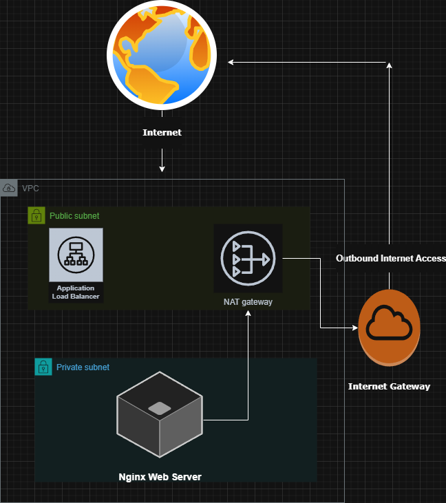

# migration-lab-2
AWS MGN migration home lab

# Migration Lab 2  
### Terraform + AWS Application Migration Service (MGN) Lift-and-Shift Simulation

This project simulates a real-world **enterprise lift-and-shift migration** using:

- Terraform
- AWS Application Migration Service (MGN)
- Private subnet architecture
- Application Load Balancer validation

The goal of this lab is to demonstrate how organizations migrate on-premise workloads into AWS while maintaining secure networking practices.

---

## Architecture Overview

This lab simulates a lift-and-shift migration into AWS using a secure, enterprise-style layout:

- **Public access is only through an Application Load Balancer (ALB)**.
- The **web server runs on an EC2 instance in a private subnet** (no public IP).
- The private instance gets outbound internet access for updates through a **NAT Gateway**.
- Administration is done through **AWS Systems Manager (SSM)** (no inbound SSH).

**Traffic flow (users):**
- Internet → ALB (Public Subnet) → EC2 (Private Subnet)

**Outbound flow (updates):**
- EC2 (Private Subnet) → NAT Gateway (Public Subnet) → Internet Gateway → Internet



```
Internet
   │
   ▼
Application Load Balancer
   │
   ▼
Private EC2 Instance (Migrated Server)
   │
   ▼
NAT Gateway → Internet
```

This design prevents direct internet exposure of application servers.

---

# Technologies Used

| Technology | Purpose |
|------------|--------|
| Terraform | Infrastructure as Code |
| AWS MGN | Server replication and migration |
| Amazon EC2 | Source and migrated servers |
| Application Load Balancer | Public entry point |
| AWS Systems Manager | Secure instance management |
| NAT Gateway | Private subnet internet access |
| Nginx | Test web application |

---

# Project Phases

## Phase 1 — Terraform Landing Zone

Terraform deployed the AWS infrastructure required for the migration environment.

Resources created:

- VPC
- Public subnet
- Private subnet
- Internet Gateway
- NAT Gateway
- Route tables
- Security groups
- IAM role for SSM
- Application Load Balancer
- Target group

Purpose:

Create a **secure landing zone** where migrated workloads can operate.

---

## Phase 2 — Source Server Simulation

A private EC2 instance was launched to simulate an on-premise application server.

Configuration steps:

- Installed **Nginx**
- Created a `/health` endpoint returning `ok`
- Verified outbound internet connectivity through the NAT Gateway
- Verified administration access using **SSM Session Manager**

Validation:

The application was accessed through the **ALB DNS endpoint**.

---

## Phase 3 — AWS MGN Replication

## Migration Workflow (AWS MGN)

This lab simulates a real lift-and-shift migration using AWS Application Migration Service (MGN).

### 1. Source Server Preparation
A Linux EC2 instance was launched in a private subnet to simulate an on-premise server.

Configuration steps:
- Installed **Nginx**
- Created a `/health` endpoint returning `ok`
- Verified outbound connectivity through the **NAT Gateway**
- Verified management access using **AWS Systems Manager (SSM)**

---

### 2. Replication Setup
The **AWS MGN replication agent** was installed on the source server.

MGN then performed:

- Continuous **block-level replication**
- Disk synchronization to AWS
- Creation of temporary **replication infrastructure**

Replication status reached **Healthy**.

---

## Phase 4 — Test Launch

A **Test Instance** was launched from AWS MGN.

Purpose:

Validate the migration before performing production cutover.

Verification steps:

1. Test instance booted successfully
2. Instance registered with ALB target group
3. Health checks passed
4. Application responded successfully

Endpoint validation:

```
/health → ok
```

---

## Phase 5 — Cutover Migration

A **Cutover Launch** was executed.

AWS MGN performed:

- Final disk synchronization
- Instance creation
- Volume attachment
- Boot of migrated server

Migration lifecycle reached:

**Cutover Complete**

Application validation again confirmed:

```
/health → ok
```

---

## Phase 6 — Infrastructure Cleanup

All resources were removed after testing.

Command executed:

```
terraform destroy
```

An issue occurred where the VPC could not be deleted due to unmanaged resources.

Investigation revealed:

AWS MGN had created replication-related **security groups outside Terraform state**.

Resolution:

1. Identify dependency
2. Locate unmanaged security groups
3. Delete replication security groups
4. Re-run `terraform destroy`

Final result:

All infrastructure successfully removed.

---

# Key Concepts Demonstrated

This lab demonstrates several important cloud engineering concepts:

- Lift-and-shift cloud migration
- Replication-based server migration
- Private subnet architecture
- Secure infrastructure design
- Application Load Balancer routing
- NAT Gateway outbound connectivity
- Infrastructure as Code lifecycle
- Migration validation testing
- Cutover migration procedures
- Terraform teardown troubleshooting

---

# Cost Controls

This lab was designed to stay within **AWS Free Tier limits**.

Cost guardrails included:

- Single Availability Zone
- Single EC2 instance
- NAT Gateway active only during testing
- Infrastructure destroyed immediately after validation

Total runtime for the environment was less than **2 hours**.

---

# Lessons Learned

A common operational issue occurred during teardown.

Terraform was unable to destroy the VPC because AWS MGN had created resources outside the Terraform state file.

Resolution required identifying and manually removing these resources before re-running the destroy command.

This scenario reflects real-world cloud operations where services create resources not managed by Infrastructure as Code.

---

# Future Improvements

Potential enhancements to this project include:

- Multi-server migration
- Multi-AZ architecture
- Blue/green migration testing
- Automated ALB target registration
- Remote Terraform state backend

---

# Author

Cloud engineering portfolio project demonstrating AWS migration workflows and Terraform infrastructure automation.
